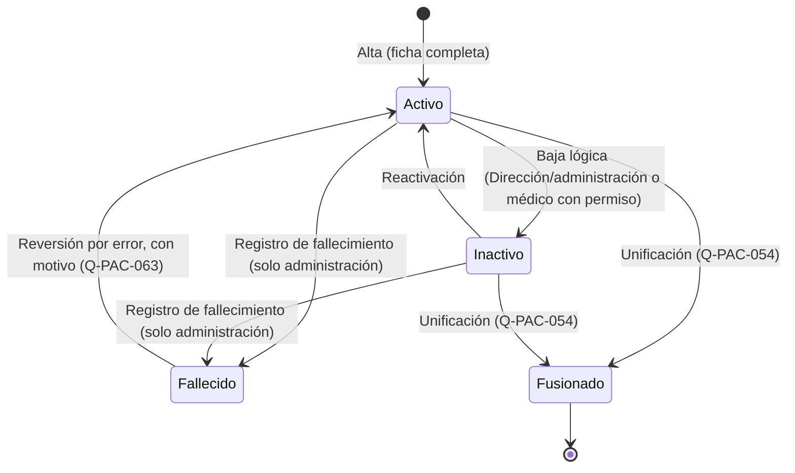
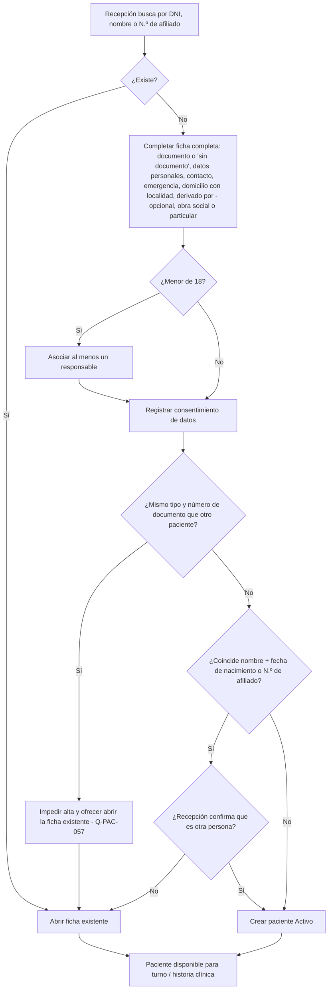
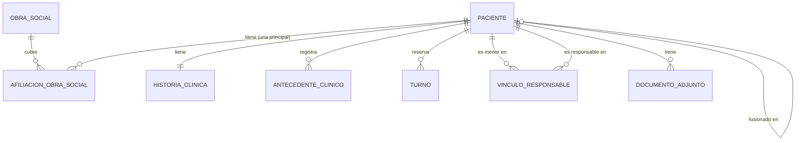

# MOD-001 — Diagramas

Actualizados el 2026-09-24 con las respuestas del cliente y de los médicos. Las transiciones que
dependían de la Ronda 3 quedaron confirmadas el 2026-09-26.

## Estados del paciente

- Ningún estado elimina datos (`RN-PAC-005`). No existe un estado "Bloqueado" aparte: la baja
  lógica cubre ese caso (`Q-PAC-013`).
- Ni la baja ni el fallecimiento disparan acciones automáticas sobre turnos, recordatorios u
  obra social (`Q-PAC-041`, `Q-PAC-062`).
- En estado `Inactivo` no se asignan turnos nuevos (`Q-PAC-062`).

## Flujo de alta de paciente en recepción

## Relación conceptual con otros módulos (vista parcial)

El responsable de un menor es otro registro de `PACIENTE` (`DEC-PAC-011`); por eso el vínculo
relaciona dos pacientes. Este modelo es conceptual; el modelo de dominio del proyecto está en
[`../../04_Modelado/modelo_dominio/modelo_conceptual.md`](../../04_Modelado/modelo_dominio/modelo_conceptual.md).
