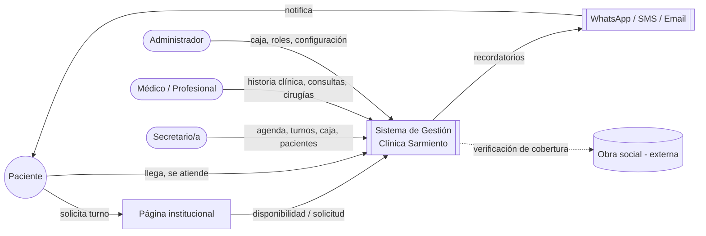

# Mapa de contexto

Vista de alto nivel de cómo el sistema se relaciona con actores externos y con la posible
página institucional. **Hipótesis de trabajo**, no un diseño validado.

La integración con obras sociales está marcada como punteada porque su alcance es
`PENDIENTE_DEFINICION` (`RC-004`) — puede ser tan simple como un dato de referencia o tan
compleja como una verificación en tiempo real, según se resuelva en `MOD-019`.

Ver también [`../05_Arquitectura/integraciones.md`](../05_Arquitectura/integraciones.md).
