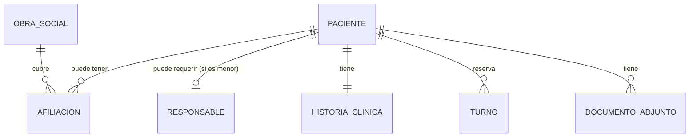

# Modelo de dominio — conceptual (borrador)

**Estado:** hipótesis de trabajo, evoluciona con cada módulo refinado. No es un modelo de
datos definitivo ni implica estructura de tablas.

## Principio de diseño

Ver [`../../01_Proyecto/vision.md`](../../01_Proyecto/vision.md): el modelo debe soportar
múltiples especialidades, profesionales y sedes sin acoplarse a oftalmología, salvo en lo
explícitamente oftalmológico (`FormulaOftalmologica`).

## Entidades candidatas (sección 22 del pedido del cliente, sin modificar el listado todavía)

```text
Paciente
Profesional
Usuario
Rol
Permiso
Especialidad
Turno
Agenda
Consulta
HistoriaClinica
Diagnostico
Prescripcion
FormulaOftalmologica
Cirugia
ObraSocial
PlanCobertura
Afiliacion
Pago
Caja
MovimientoCaja
Sede
Consultorio
Notificacion
DocumentoClinico
```

Esta lista **no es definitiva**: surge del pedido inicial del cliente y debe confirmarse o
ajustarse a medida que cada módulo se refina (empezando por `Paciente`, ver más abajo).

## Relaciones conceptuales identificadas hasta ahora (solo alrededor de Paciente)



Cardinalidades marcadas como hipótesis (`||--o{`, etc.) están sujetas a las respuestas de
[`../../03_Modulos/MOD-001_Pacientes/preguntas.md`](../../03_Modulos/MOD-001_Pacientes/preguntas.md)
— en particular `Q-PAC-018` (¿una o varias obras sociales?) y `Q-PAC-022`/`Q-PAC-024`
(¿uno o varios responsables?).

## Extensibilidad

`Profesional` se relaciona con `Especialidad` (posiblemente N:M, un profesional puede tener
más de una especialidad) en lugar de existir un tipo rígido "MédicoOftalmólogo". Esta relación
todavía no fue refinada (pertenece a `MOD-015`/`MOD-016`, no refinados en esta iteración).

## Próximos pasos

Este modelo se completa entidad por entidad, a medida que cada módulo pasa por
`EN_REFINAMIENTO`. No se debe completar de forma anticipada para módulos no refinados, para no
introducir supuestos no validados en lo que debe ser una fuente de verdad.
