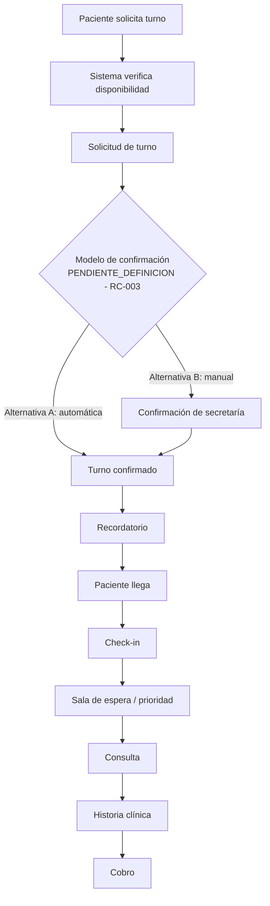

# Proceso de negocio hipotético — Ciclo de un turno

**Este flujo es una HIPÓTESIS de trabajo**, tal como lo anticipa el propio pedido del cliente
(sección 21). No representa un proceso validado; sirve para razonar sobre los módulos
involucrados y generar preguntas cuando cada uno se refine.

## Módulos involucrados por etapa

| Etapa | Módulo |
|---|---|
| Solicitud de turno | MOD-033, MOD-034 |
| Confirmación | MOD-033, MOD-035, MOD-010 |
| Recordatorio | MOD-014, MOD-029, MOD-030/031 |
| Check-in | MOD-011 |
| Sala de espera | MOD-012 |
| Consulta | MOD-003, MOD-009 |
| Historia clínica | MOD-002, MOD-004, MOD-005 |
| Cobro | MOD-022, MOD-023 |

Este documento se reemplaza por procesos validados a medida que cada módulo involucrado se
refina y aprueba. No debe usarse como especificación de comportamiento real todavía.
